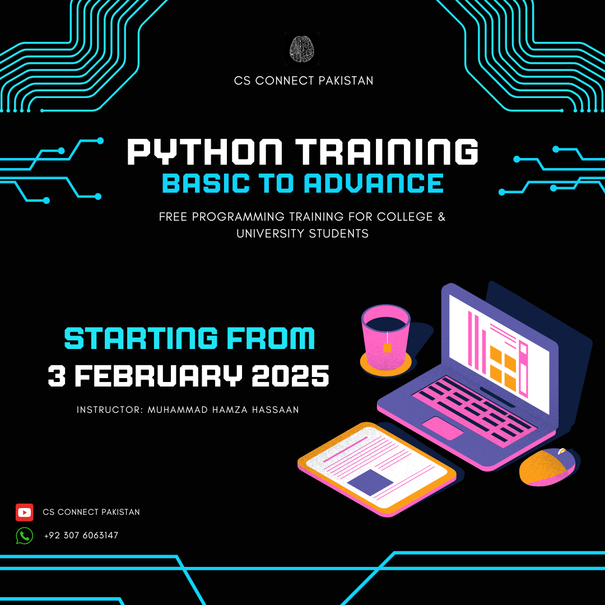

# 🐍 Learn Python: A Journey from Beginner to Pro

Welcome to the **Python Learning Repository**! 🚀 This repository is designed to help **college and university students** master Python, one of the most powerful and in-demand programming languages.

---

## 🎯 Why Learn Python?

Python is more than just a programming language—it's a **gateway to innovation** and **career opportunities** in various fields, including:

✅ **Software Development** – Build applications, websites, and automation scripts.  
✅ **Data Science & AI** – Analyze data, build machine learning models, and explore artificial intelligence.  
✅ **Cybersecurity & Ethical Hacking** – Automate security tasks and develop penetration testing tools.  
✅ **Game Development** – Create interactive games using libraries like Pygame.  
✅ **Automation & Scripting** – Save time by automating repetitive tasks.  

Python's **simple syntax** makes it **beginner-friendly**, yet it's powerful enough for **industry professionals**.  

---

## 📚 What You'll Learn

This repository contains **structured lessons** and **hands-on projects** covering:

1. **Python Basics** – 
        Variables, 
        data types, 
        loops, 
        functions, 
        and more.
2. **Object-Oriented Programming (OOP)** – 
        Classes, 
        objects, 
        inheritance, 
        and encapsulation.  

---
## 📩 Stay Connected  

Stay updated with new lessons, exercises, and challenges.  

📧 **Email:** damn.code.hamza@example.com  
🌐 **LinkedIn:** [My Profile](https://www.linkedin.com/in/muhammad-hamza-hassaan-29920a25a/)  

Happy Coding! 🚀🐍  
